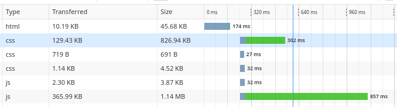

# Javascript 

## Introduction
JavaScript is a scripting or programming language that allows you to implement complex features on web pages. It enriches both HTML and CSS languages by allowing complex operations of their entities, mostly HTML ones. JavaScript enables you to create dynamically updating content, control multimedia, animate images, react to events in the page and pretty much everything else. It is the **third** layer of the standard web technologies.

One of the great strength of the client-side JavaScript is the functionnality built on top of it. So-called API (standing for Application Programming Interfaces), they provide extra and important features, ready to use. They generally fall into two categories:

* Brower APIs
* Third Party APIs


**Browser APIs** are built into your web browser, and are able to do useful complex operations as well as using data from the computer environment. Examples are:
* DOM (Document Object Model) API
* XmlHttpRequest (XHR) API
* Canvas et WebGL APIs
* ...

**Third party APIs** are APIs not built directly in the browser. Instead, you rely on other provider to give acces to the code somewhere on the web.
* Twitter API
* OpenStreetMap API

On an **security note**, each browser tab creates its own separate execution environment, generally preventing that a code can affect a code runing in another tab.

On a **performance note**, JavaScript is an interpreted non-typed language, which means it is not compilled into another form and that variable does not have a type. This has the main advantage of being easly readable and easily modifiable on the flight. However, this hinders somewhat its performance compared to other compiled language. Nevertheless, from a technical standpoint, most modern JavaScript interpreters actually use a technique called just-in-time compiling to improve performance; the JavaScript source code gets compiled into a faster, binary format while the script is being used.

## JavaScript requires you to code cleanly and be careful
JavaScript interprets a lot of things and allows some ambigus semantic, thus encouraging bad practices and habits, which can quickly transfer to other languages (e.g. anonymous function in C++? wtf). You **must** be careful when coding and well designing your code, otherwise this will quickly run into a coding hell!

For example, the variable hoisting concept:
```js
undeclaredVar = 7; //unpreviously declated variable.

var underclaredVar; //ok.
```

Other example with arrays manipulation:
```js
var arr = [];
arr.length → 0
arr[3] → "undefined" // No array bounds exception
arr[3] = "hi";
arr.length → 4 // Only one element has been added, but at the third index, misleading the length counter
arr["3"] → "hi" // Apparently "3" is coerced into a number
delete(arr[3]);
arr.length → 4 // 4??? There are no elements in the array!
arr[3] → "undefined" // 7 lines above, length was "0"...
```
Oh, you also have an auto semi-colon adder, which means that `var a = 7;` is equal to `var a = 7`...

For fun, go check this [video](https://www.destroyallsoftware.com/talks/wat) and start the video at `1:22`, or even this [one](https://www.destroyallsoftware.com/talks/the-birth-and-death-of-javascript).

## How to insert your script in your page
To insert some javascript to your page, there is only one way: by using the `<script>` element. Generally speaking, this element is placed in between the `<head>` element of your page. One `script` element is used for one javascript script, so if you have several of them, the same goes for the elements.

```html
<!DOCTYPE html>
<html lang="en">
    <head>
        <meta charset="UTF-8" />
        <meta name="viewport" content="width=device-width, initial-scale=1" />

        <!-- STYLES -->
        <link rel="stylesheet" href="../view/style/taskmenu.css" />

        <!-- SCRIPTS -->
        <script src="../model/board_global_config.js"></script>
        <script src="../model/taskboard_pool.js"></script>
    </head>
    <body>
    ...
```

Note that even if you can put javascript code directly inside a `<script>` element, this is strongly discouraged. Instead, correctly organise your scripts.

### Think of your scripts loading strategies
There are a number of issues involved with getting scripts to load at the right time. A common problem is that all the HTML on a page is loaded **in the order in which it appears** in your code (thus, from top to bottom). If you are using JavaScript to manipulate elements on the page (or more accurately, the Document Object Model -- or DOM), your code won't work if the JavaScript is loaded and parsed before the HTML you are trying to do something to.

Generally speaking, this will generate errors when your JavaScript will be interpreted by the web browser. For example, associating an event lister to a specific HTML element which does not yet exist will return an error. Thankfuly, there is some strategies to circumvent this problem.



Here, we can see the loading strategies of the page: first load the html, then load all the other resources.

#### The good ol' way
The old way consists to listen the main document of your page and catch the event related to the HTML body being completely loaded and parser. The event is `DOMContentLoaded`. Consequently, the content inside such an event listener will not run until after that event is fired (then catch): this prevent the error to happens.
However, this is rather a disgracious method.

```js
document.addEventListener("DOMContentLoaded", function() {
  ...
});
```

#### The now way
There are actually two modern features we can use to bypass the problem of the blocking script:
* `async`
* `defer`

Scripts loaded using the `async` attribute will download the script without blocking rendering the page and will execute it as soon as the script finishes downloading. You get **no guarantee that scripts will run in any specific order**, only that they will not stop the rest of the page from displaying. It is best to use async when the scripts in the page run independently from each other and depend on no other script on the page.

`async` should be used when you have a bunch of background scripts to load in, and you just want to get them in place as soon as possible.

Inversely, scripts loaded using the `defer` attribute will run in the order they appear in the page and execute them as soon as the script and content are downloaded.

Thus, if the script `taskboard_pool.js` relies on `board_global_config.js` (for example, the later creates useful data structures for the other type of boards), then you should use `defer` for the loading.
```html
<script src="../model/board_global_config.js" defer></script>
<script src="../model/taskboard_pool.js" defer></script>
```

## Intensively use your Web Browser!

Nowaday, recent web browsers, especially Firefox and Chromium based web browser can be considered as small IDEs. They implement strong features, easy to use, such as:
* **An HTML inspector**
* **A console**
* **A debugger**
* **A network observer**
* **A profiler**

The debuggers are especially not to be underevaluated. They are really strong, and since JS is an interpreted language, they can modify the context of any bloc, variables and functions on the flight.
