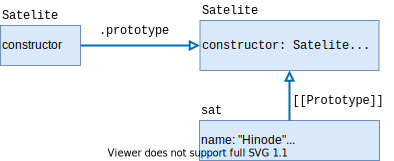

# Inheritance and prototype

## Prototype
In JavaScript, there **always** exists a special property for each object called `[[Prototype]]`, that is either `null` or a reference to another object, called a **prototype**. Prototypes are used to perform **prototypal inheritance**, which means than the prototype of an object **extends** this very object. In other, this allows an object to directly reuse properties and methods from its prototype **automatically**: this is transparent for the developper!

This property `[[Prototype]]` is internal and hidden: you will not iterate over it with `for...in` loop for example -- instead you will iterate overs the properties/methods of the prototype. Their is several ways to access the prototype, such as the historical `__proto__`, but we will not use it anymore. Instead, we will use the class oriented methods, more clean: `Object.getPrototypeOf()` and `Object.setPrototypeOf()`.

Let's illustrate prototype setting and automatic access of the prototypal chain:
```js
let martialArt = {
  grade: "3rd Dan",
  fight(){
    console.log("Tōōōō~~~");
  },
}

let kendo = {
  armor: true,
}

let kendoTournament = {
  participant: 105,
}

Object.setPrototypeOf(kendo, martialArt); // we set the prototype of kendo with martialArt obecjt
Object.setPrototypeOf(kendoTournament, kendo); // IDEM kT with kendo, which has its prototype filed with martialArt!

alert(kendo.armor); //true
alert(kendo.grade); //"3rd Dan"
alert(kendo.participant); // Error // We can't go "down" the prototype chain
alert(kendoTournament.armor); //true
alert(kendoTournament.grade); // "3rd Dan", we go up again in the prototype and get martialArt property!
alert(kendoTournament.fight()); // "Tōōōō~~~"
```

Visually, this give something like:


As you can see, there is one additional prototype, which is the `Object.prototype`. Indeed, when you create an object, JavaScript automatically attach to this object the `Object.prototype` in the exemple: this gives us access to a lot of useful function defined for all the object, such as `toString()`.

### Execution context: `this`
Since `this` is dynamic in JavaScript, an iterrogation may arise: what is the value of `this` once in the prototype chain?

The answer is **always** the initial object calling the property/methods, not the objects from the prototype chain: `this` is not affected by the prototype chain at all.


> ❓ Use the following rule to help you find the value of `this`: no matter where the method is found, `this` is always the object before the `.` (dot)!


```js
let martialArt = {
  grade: "3rd Dan",
  fight(){
    if(this.versus)
      console.log("HAJIME!");
  },
  makeVersus()
  {
    this.versus= true;
  }
}

let kendo = {
  armor: true,
}

Object.setPrototypeOf(kendo, martialArt);

kendo.makeVersus();

alert(kendo.fight); // cli: HAJIME!
alert(martialArt); // Undefined variable this.versus in the prototype
```

What happens here is that the variable `versus` has been attached to the calling object `kendo`, despite the fact the function that creates it is in its prototype (`martialArt`). `martialArt` does not have a `versus` variable after that.


> ⚠️ There is no *hoisting* (cf. [Advanced reminder](advanced.md)) concept involved here!


### Override in writting
The prorotype is only used for **reading** properties and methods, not for writting them. Write operation (as for delete though) works directly with the object itself. Thus, you can rewritte an actual function existing in the prototype by the object's own definition of the method.

```js
let martialArt = {
  grade: "3rd Dan",
  fight(){
    console.log("Tōōōō~~~"); // this method will not longer be used by kendo
  },
}

let kendo = {
  armor: true,
}
Object.setPrototypeOf(kendo, martialArt);

kendo.fight = function(){
  console.log("Geikō time! BANZAI!");
}
alert(kendo.fight); // Geikō time! BANZAI!
```


> ❓ This works as an override because now, JavaScript directly find the method you are calling: thus is does not have the need to go back up the prototype chain.


### Manually extending object: F.prototype
By now, it should be clear how prototype can be used for object inheritance. As stated above, this is called **prototypal inheritance**. Here we will see how we can extend an object using constructor function and `new` operator by using a property named `prototype`.


> ⚠️ Here we speak of a *special* property called `prototype`, not the `[[Prototype]]` seen above. It is only used once: while construction an object *via* a function thanks to `new`.


This property `prototype` of a constructor function (cf. [OOP section](poo.md)) means the following: "When a `new` object is created (by using the `new` operator), assigns its `[[Prototype]]` to the given object". By this mean, all the objects from a constructor function created with `new` will all have the object as prototype.

```js
let martialArt = {
  grade: "3rd Dan",
  fight(){
    console.log("Tōōōō~~~");
  },
}

function Kendoka(armor){
  this.armor = armor;
}

Kendoka.prototype = martialArt; // all the instance of Kendoka will have martialArt object in their direct prototype chain

let kendo = new Kendoka(true);
alert(kendo.grade) // 3rd Dan
```

## Class inheritance
Class inheritance is a basic feature in OOP allowing to extends the functionalities of a class with ones from another class. In JavaScript, it is basically a syntactic sugar for prototype manipulation.

```js
class Satelite{
  constructor(name, velocity=-1)
  {
    this.name = name; this.velocity = velocity;
  }

  beAttracted(velocity){
    this.velocity += (velocity * 9.8);
    console.log("I'm attracted... by u!");
  }

  explode()
  {
    this.velocity = 0;
    console.log("K... B O O M");
  }
}

let sat = new Satelite("Hinode", 500);
```

This is how graphically the above example can be represented:



Now, if we want to create a new class, lets say `Planet`, that is based on `Satelite` (*i.e.* that share similar concepts), we can use the `extends` keyword to indicate so. The global syntax is `class Child extends Parents`. In our example, this will result in:

```js
class Planet extends Satelite{
  rotate(degree){
    this.rotation += degree;
    console.log("I'm rotating! Youhou!");
  }
}

let venus = new Planet("Venus"); // <- Observe that we used the Planet constructor calling the Satelite constructor!

venus.rotate(20); // I'm rotating! Youhou!
venus.beAttracted(300); // I'm attracted... by u!
```


Internally, `extends` keyword works using prototype mechanism. It sets `Planet.prototype.[[Prototype]]` to `Satelite.prototype`. So, if a method is not found in `Planet.prototype`, JavaScript takes it from `Satelite.prototype`, as we have seen before.


> ❓ While `extends` is often used with class, you can put any expression after. That means a class can extends a function for example.


### Overriding
As said previously, when JavaScript is told to execute a specific method from an object, it firts checks if this object has a property of that name. If not, it goes back up the object prototype and checks in it, and repeats the operation while the property has not beend found or there is no more prototype to explore. That means if we define a new `explode` method in `Planet`, all planet object will have a function property named `explode`: JavaScript will not bother to go back up the prototype chain. This is called **overriding** a method.

However, when overriding a method from the parent class, we often want to build on top of it, not entierely replace it. In other want, we want to call the parent method before (or after), then perform the class's specific operations. To do so, we use the `super` keyword (*e.g.* `super.explode()`).

```js
class Planet extends Satelite{
  rotate(degree){...}

  explode(){
    this.rotate(15000); // Lets spins a little the ball of death before exploding!
    super.explode();
  }
}

let venus = new Planet("Venus");

venus.explode(); //  I'm rotating! Youhou! ; "K... B O O M"
```

`super` can also be used to override constructor. Currently, Planet does not have is own constructor, it relies entierely on the Satelite constructor. But if your class needs to have a specific construction, you can't rely entierely on the parent class (which is probable more generic). Calling a constructor parent with `super(...)` can only be done in a constructor.

```js
class Planet extends Satelite{
  constructor(name, rotate){
    super(name, 0); // calling the constructor of Parent (and creating the first "part" for planet)
    this.rotate = rotate;
  }
}
```


A child constructor **MUST** always have a call to its parent constructor (`super(...)`)! In addition, this call **MUST** be made before any property affection (*e.g.* `this.x = smth`). This is logical, because you build your child on top of your parent!



When a class extends another class, and has no constructor, JavaScript create a default constructor, directly calling the parent constructor. The default constructor is the following:
```js
  constructor(...args) {
    super(...args);
  }
```



As a consequence of overriding the default constructor, it becomes unavailable. Once you define your own constructor(s) (for an extended class), you can't call `new MyClass()` anymore.


### Protected and private inheritance: reminder
Protected fields are not supported to the language-level. As so, the convention is to used the `_` to prefix them (cf. [OOP section](poo.md)). A direct consequence of this is that protected fields are directly accessible from a child to its parents -- since they are just properties obfuscated.

Private fields in the other hand **are not** inherited. There is no direct access to a private methods/attributes from a child to its parent. Consequently, you will need to rely on both getter and setter to retrieve the information, otherwise JavaScript will throw an error.


Such a limitation can be sometimes to severe. It is up to you to determine whether or not it is good for you code to use private fields over protected one, and all the implications that it creates.


### Static inheritance
Static methods and static properties are also inherited!

```js
class Satelite{
  static place = "Universe";
  constructor(name, velocity){...}
  beAttracted(){...}
  explode(){...}

  static compareSatVelocity(sateliteA, sateliteB)
  {
    return sateliteA.velocity - satelireB.velocity;
  }
}

class Planet extends Satelite{
  rotate(){...}
}

let planets = [
  new Planet("Venus", 120),
  new Planet("Mars", 80),
]

planets.sort(Planet.compare); //call the sort method of Arrays, using the static method from satelite to compare
console.log(planets[0].name); // cli: Mars
console.log(planets[0].place); // cli: Universe
```


### Mixins: or multi-inheritance 
As we have seen, there is only one `[[Prototype]]` for an object at a time. This implies that multi-inheritance is **not possible** using extends. Despite this prevents complex and dangerous inheritances (like diamond ones), this can feel a little limitating. To alleviate this, JavaScript implements **mixin**.

A way to implement a mixin in JavaScript is to define an object continue the desired useful methods, and then merge them to the desired objects, by using the `Object.assign(source, mixin)` function.

```js
let myMixin = {
  usefulFunc(){
    console.log("Hello, I'm a useful func");
  },

  sayHW()
  {
    alert("Hello World");
  }
}

class A{
  constructor(name)
  { this.name = name; }
}

Object.assign(A.prototype, myMixin);
new A("testMixin").usefulFunc();
```


From [wikipedia](https://en.wikipedia.org/wiki/Mixin):
> A mixin is a class that contains methods for use by other classes without having to be the parent class of those other classes.



Mixin is a simple method copying process made by JavaScript: it does not consume the `extends` slot.


## Method and function borrowing
Sometimes, you will just want to use a specific method from another class, and inheriting from it could be misconceptual (*i.e.* inheriting a Planet while the child is Pencil). It is possible to borrow methods from an object, by using the `bind`, `apply` and `call` keywords.


Go check online for resources! Like [this one](https://medium.com/@ensallee/function-borrowing-in-javascript-4bd671e9d7b4) or [this one](https://www.codingame.com/playgrounds/9799/learn-solve-call-apply-and-bind-methods-in-javascript).


Just a word on `bind` thought. This very useful keyword allows us to set the value of `this` to the provided value.

Example (from [MDN](https://developer.mozilla.org/en-US/docs/Web/JavaScript/Reference/Global_Objects/Function/bind)):
```js
const module = {
  x: 42,
  getX: function() {
    return this.x;
  }
};

const unboundGetX = module.getX;
console.log(unboundGetX()); // The function gets invoked at the global scope
// expected output: undefined

const boundGetX = unboundGetX.bind(module);
console.log(boundGetX());
// expected output: 42
```


Hook example : 
```js
var hooks = {};

function add_to_function(name, func) {
  if(!hooks[name]) hooks[name] = [];
  hooks[name].push(func);
}

function call_my_function(name, ...params){
  if(hooks[name]) 
     hooks[name].forEach(func => func(...params));
}
```
