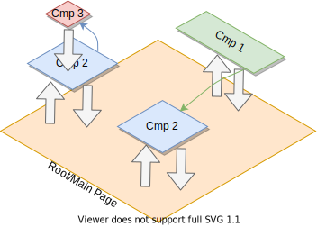

# Web Component Principle

## Overview
HTML has never be user friendly regarding its reusable aspect. In complex page structures, where lot of UI custom are placed, the document can quickly become a mess (mostly due to a lot of copy paste, modifying few ids and classes). However, as developpers, we know that reusable and small code is a good idea, if not only for code maintenance.

Web components is a suite of technologies that has been created to address this problem of reusability in web page. The idea behind web components is to break a web page into small and reusable blocks, with their own custom logic and states, where they can communicate between each other, mostly *via* events and recativity (*i.e.* when an object's attribute change). This allows a better encapsulation and help the developpers to seperate the view from the application logic (the model).

If we take a look at a web page, we can see that some elements are redudant and can be derivated into web components (and maybe it is already the case here!).


In a web component approach, such a page could be transcripted into the following HTML code:
```html
<div id="app">
  <app-nav></app-nav> <!--Login,search etc component: include a search component, a login component-->
  <app-view>
    <app-overviewbar></app-overviewbar>
    <app-content></app-content> <!--Contain a lot of <app-story> components-->
  </app-view>
</div>
```
To achieve this building philosophy, web components rely on shadow dom, preventing them to leak outside their respective DOM. Thanks to dedicated JavaScript framework, Shadow DOM manipulation is often transparent to the programmer.


Shadow DOM is a functionality that allows the web browser to render DOM elements without putting them into the main document DOM tree. This creates a barrier between what the developer and the browser can reach; the developer cannot access the Shadow DOM in the same way they would with nested elements, while the browser can render and modify that code the same way it would with nested elements. However, elements declared in the shadow dom can still fire events that can be handled by other elements in the document ([Wiki](https://en.wikipedia.org/wiki/Web_Components#Shadow_DOM)).


Vue.js components are written as a combination of JavaScript objects that manage the app's data and an HTML-based template syntax that maps to the underlying DOM structure.  

## Template principle
As we have seen above, a web component is an encapsulation of one or several specific HTML elements (native and/or custom component) supposed to work together in a specific way in order to make an action or an application logic easily reusable. A web component **is** a custom HTLM element, generally "reactive", which is usable as any other HTML element in your document. But two instances of a same web component can have a different state.

This last fact implies that a web component definition introduces some variabilities in its HTML code. Such an adaptive code is called a template. It describes how it should be rendered (from an HTML point of view) by identifying which part of the HTML is static, and the other part is dynamic. This allows the web component to update itsefl depending on the current state of its data, consequently reflecting the change to the user accordingly.

An example of a template, in `my-logInfo-component.vue`:
```html
<my-logInfo-component><!--no need to introduce body or html!-->
  <p>
    You are logged as : <span>{{ user.name }}</span>
  </p>
  <div v-if="connected">
    <input name="Disconnect"/>
  </div>
</my-logInfo-component>
```
Here, we specify a component designed to display user's information, and if connected, a button to disconnect it, mostly by using HTML code plus some specific attributes (we will see them later). Let's say we have two user now, we could have two instances (or more!) of this web component in our page:

```html
<html>
  <body>
    <my-logInfo-component user="user1"></my-logInfo-component> <!--Just displaying You are logged as : Alexis Lebis -->
    <my-logInfo-component user="user2" connected="true"></my-logInfo-component> <!--Display : You are logged as : Luc Fabresse  **AND** the Disconnect button-->
  </body>
</html>
```

This is just an illustrative example. The syntax in Vue.js will be a little different.


As you can see, we somewhat "paste" the content of the web component's template -- instanciated -- inside the custom HTML. Thus, during the rendering, the HTML is adapted to the state of the component (like PHP in some way, except this is dynamic).


If you are wondering, the logic of your web component is directly associated to your view/template. The way the association is made depends of the framework used. In any case, you can privately use the data and method you declare in your component, and handle any events.


## Binding and Reactivity
Binding is the concept of passing existing data to a web component, and storing the passed data into the component (to use it). In the example above, we bind the object `user1` and `user2` to respectively the first and the second `<my-logInfo-component>` components. Binding data to components is useful to instanciate them correctly. Like that, you can pass a data from a parent to a child component, again to a child component that needs specifically this data to correctly instatiate.

Moreover, binding data allows a powerful mechanism to take place: **reactivity**. The reactivity consists of two things. Firstly, it kept the binded data synchronized. Secondly, and this is powerful, it listens to any change made in the parent data, and re-render the components which depends on it. This makes the page dynamic and keeps all the element synchronized. 

There is also the two-ways binding, which simply consists of listen to any modification for the parent data, or the child data. Thus, once the data change, from either component level, the modification is taken into account, and the component re-rendered. Thanks to that, it is also possible to share data accross component not only in depth, but also in wide.

Check the illustration below. We have a main page where three components, where two are different instances of the same component, are attached to the main page. On the first blue component, we also attach a third component. Big arrows represent simple or double binding, thin arrows represents cross binding.


