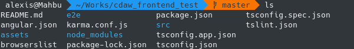

# Front end project set-up & organisation

For the project, you will:
1. Intensively use git. Thus you need to have a GitLab gVipers account accessible.
2. Use Angular as your web-application framework
3. Use the riichi mahjong tiles assets available [here](https://github.com/FluffyStuff/riichi-mahjong-tiles). These are svg assets of all the icons, as well as back and black of a tile : you will have to assemble them yourself in your game.

We will consider this majhong tiles project as a deleguate third party work : we don't handle its developpement and therefore you need to conserve a dependency of it in your project. Consequently, we will use **git submodule**.

Word of caution: all the examples are shown using **Linux (Debian)**.

## Create a new repository in Gvipers for your front end project
Go to [Gvipers](https://gvipers.imt-lille-douai.fr/) and login.

Create your team for the project (if it does not already exists or has been created by your teachers), then create a new repository associated to your team for the front-end project.
For the rest of this section, this repository is called `repo`.

## Initialize your Angular project
⚠️ This step should be made by only one person (preferably the manager of the project), then, once push to the remote, all the other collaborators should clone it.

First, clone your repository.

```bash
cd your/Path
git clone https://gvipers.imt/url/to/your/repo
cd repo
```

Then you will need to have both Node.js and Angular installed.
```bash
sudo apt install nodejs npm
```
Afterwards, you want to install Angular CLI globally
```bash
sudo npm install -g @angular/cli
```
This installs the command `ng` on your system, which is the command you use to create new workspaces, new projects, serve your application during development, or produce builds to share or distribute.

We will populate your empty repository with a new empty pre-configured Angular project, acting as a backbone for the front-end for now. In your local repository, type:

```bash
ng new the-App-Name --directory ./
```

Answer `yes` to the question `Would you like to add Angular routing?`, and select `CSS` to the prompt regarding stylesheet.

After the installation of some additional packages, your local repository should looks like that:



To check if your project works correctly, stay at the root of your project, then compile and serve it:
```bash
ng serve
```

Last step: add all these modifications as the starting point of your project by commiting the change, then pushing them to the remote.
```bash
git add -A
git commit -m "Angual init"
git push
```

## Set up your dependencies

### Correctly initialize your project

⚠️ This step should be made by only one person (preferably the manager of the project), then, once push to the remote, all the other collaborators should clone it (cf. *Correctly clone your project* section)

If your front end repo is not yet on your local machine:

```bash
cd your/Path
git clone https://gvipers.imt/url/to/your/repo
cd repo
```

Now, we need to add the GitHub repo about riichi tiles as a submodule of our project. To do this:

```bash
git submodule add https://github.com/FluffyStuff/riichi-mahjong-tiles.git ./src/assets/img/mahjong-tiles
git status
```

After cloning the submodule in your local repository, printing the status of your local should show you some changes, like:


Indicating that you have correctly added the repository (and now located in assests/img/majhong-tiles).
You are all good to start working with Angular now for your front end!

Don't forget to add/commit your modification! Then push them to the remote.

### Correctly clone your project when it has submodule

When a project with submodules is cloned using git clone, it creates the directories that contain submodules, but none of the files within them! To retrieve their content, you need to perform two additional information.
1. `git submodule init` will update the local .git/config with the mapping from the .gitmodules file.
2. `git submodule update` will then fetch all the data from the submodule project and check out the mapped commit in the parent project.

From then, your project is correctly cloned, and all the dependencies are available.

To sum up all the actions:
```bash
cd your/Path
git clone https://gvipers.imt/url/to/your/repo
cd repo
git submodule init
git submodule update
```

### A word about submodules
Once properly init and update within a parent repository, a submodule can be used exactly like a standalone repository. This means it can be modified, commited, etc... 

More information: [Atlassian Submodule Tuto](https://www.atlassian.com/git/tutorials/git-submodule)