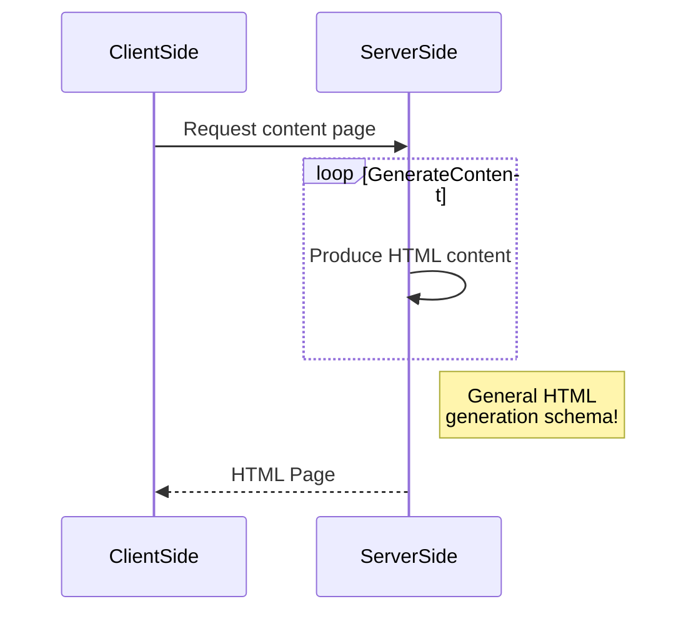

# Maquetage web site (UX)

## Author
* [Mathieu Vermeulen](https://gvipers.imt-lille-douai.fr/Thieu)

# Introduction à l'UX Design, la conception centrée utilisateur
Blabla

## L'eXpérience Utilisateur ?
Définition

## UX Design, qu'est ce donc ?
Définition et schéma


# [Planification](planification.md) 
Lien

# [Exploration(exploration.md)]
Lien

# [Idéation](ideation.md)
Lien

# [Génération](generation.md)
lien

# [Évaluation](evaluation.md)
Lien

## [Charte graphique](graphique.md)
Lien

## [Ergonomie (light)](ergonomie.md)
Lien

## [Bibliographie](bibliographie.md)
Lien

# Organisation du cours
Cette introduction s'intègre dans l'**UV CDAW** et participe au projet global par lequel vous serez évalué.
1. **Lundi 9 novembre (2 heures)** Planification : du blabla, des définitions, un peu d'ergonomie et de principes sur le graphisme (ou l'inverse).
2. **Vendredi 13 novembre (4 heures)** Exploration, Idéation : il faut définir des Users Stories, vous allez faire une maquette avec un outil de... maquettage, puis on va évaluer tout ça par des utilisateurs.
3. **Lundi 16 novembre (4 heures)** Génération : Vous savez faire du CSS et du HTML ? Ça tombe bien ! Mise en pratique pour votre projet, passer d'une maquette à une autre maquette.
4. **Jeudi 19 novembre (2 heures)** Évaluation : Nouvelle évaluation, chacun va présenter son travail en 5 minutes avec des arguments (pourquoi du rouge ? Et pourquoi mes tuiles sont en pixelart ?) et fin.

# Évaluation du cours
Ce cours sera donc évaluer au travers du projet que vous réaliserez lors de l'UV CDAW. Je prendrai en compte les arguments de la présentation que vous ferez lors de la dernière séance pour ajuster la notation. Globalement, on s'intéresse ici aux aspects méthodologiques, graphiques, ergonomiques et imaginatifs. En gros, je vais observer vos compétences : 
* organisationelles (au niveau projet et travail collaboratif), 
* artistiques (pas votre niveau en dessin ou en musique, on est d'accord, * mais votre capacité à créer du beau), 
* d'analyse (sur voter travail et celui de vos collègues),
* d'ingénieur-designer responsable (tout ça en même temps : j'ai un problème, je cherche une solution SMART et belle)

Mais en 12 heures seulement, je serai pragmatique :-D


****************************************
## Titre de niveau 'nombre de #'
Texte
*Texte* italic
**Texte** bold
`Texte` code
> Texte mode citation
```css
For while (code informatique non interprété)
```

[label du lien : aller vers Google](http://www.google.fr) lien web


Super séléction : command+option+shift+bas
* T1
* T2
* T3 liste à puce

1. t1
2. t2
3. t3 liste numérotée



