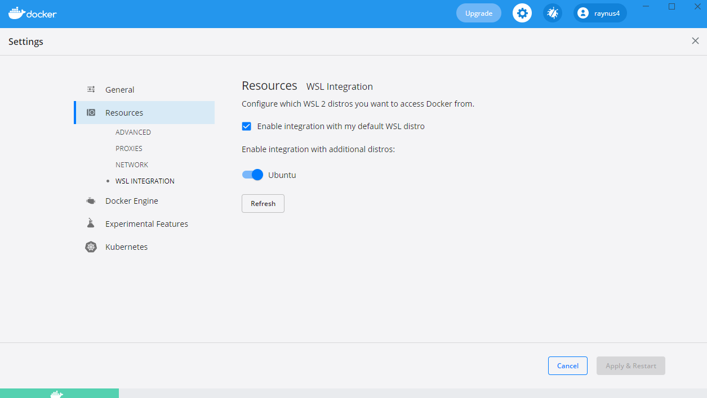

# Docker on Windows & WSL

Docker sur Windows est très lent à cause de l'accès aux fichiers partagés à travers des `bind mount`.
Ci-dessous une procédure d'installation qui ~~devrait~~ règler le problème.

## Configurer Docker pour utiliser Ubuntu WSL2

1. Installer Ubuntu depuis le microsoft store
2. Dans un terminal windows (`cmd.exe`) taper la commande :
    ```
    wsl --list --verbose
    NAME            STATE           VERSION
    ...
    Ubuntu-20.04    Stopped         1
    ```
    Si la version de votre Ubuntu est 1 au lieu de 2, vous devez la migrer en 2 avec la commande: `wsl --set-version Ubuntu-20.04 2`
    Bien contrôler que la version WSL de ubuntu est 2.
3. Dans les préférences de l'application Docker :
    ```
    General>"Use WSL 2 based Engine" coché
    Resources>WSL Integration, activer "Ubuntu 20.04"
    Apply & Restart
    ```
    
4. Dans un terminal Ubuntu :
    ```
    git clone https://github.com/xxx/yyy UV_CDAW
    code UV_CDAW
    # NE PAS LANCER "reopen in container"
    ```
5. Editer le fichier `.devcontainer/docker-compose.yml`
   Enlever le `/` à la fin de la ligne 11:
    ```
        - ../public:/var/www/html
    ```
    Contournement d'un bug docker-compose v2 dans WSL2.
6. Dans vscode, F1 `>rebuild container`
7. Tester `http://localhost:8080`

## Installer Laravel

Si votre projet Laravel n'était pas commité dans votre dépôt git, le recreer doit prendre 5 min maximum.
S'il était commité, il suffit de régler des problèmes de droits sur les fichiers.

1. Dans un terminal VScode dans un conteneur :
```
cd public
composer create-project --prefer-dist laravel/laravel catalogue
```
2. vérifier qu'Apache a bien les droits :
    - en lecture sur toute la hierachie `catalogue`
    - en lecture et écriture sur toute la hierarhie `catalogue/storage`
3. Tester `http://localhost:8080/catalogue/public/`

