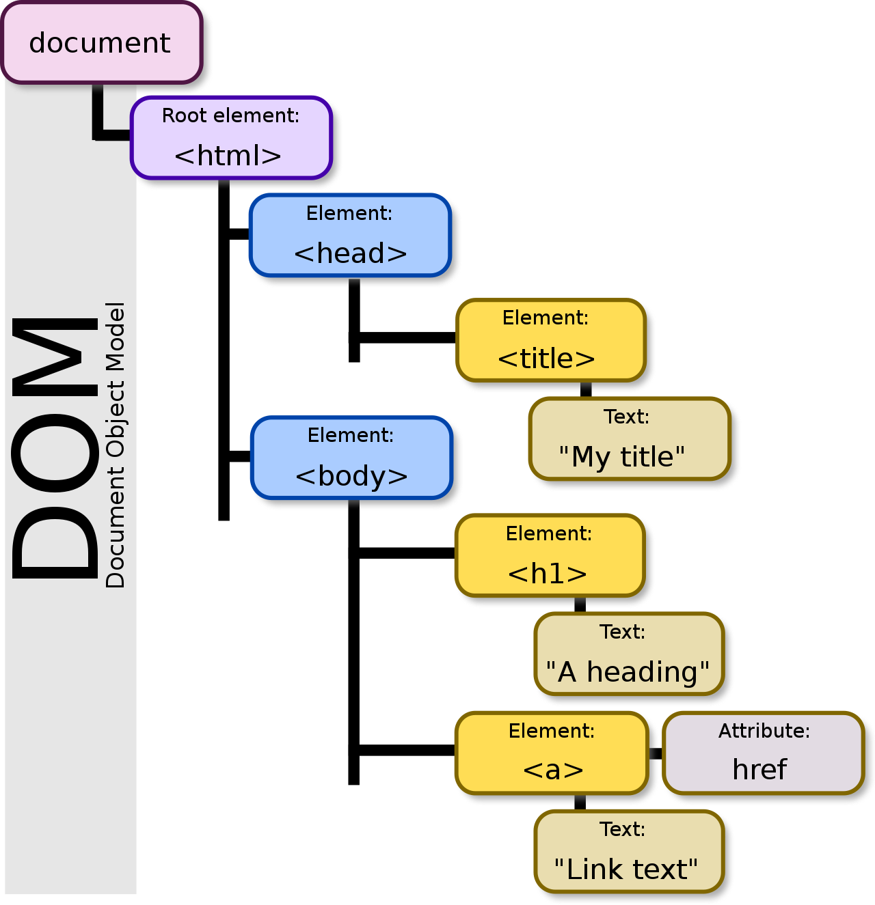

# Manipulation du Document Object Model

## Objectif pour le projet

* Apprendre à requêter le DOM et récupérer ses éléments
* Ajouter, supprimer et modifier de nouveaux objets dans le DOM

## Cours
Le DOM, pour *Document Object Model*, est une API (*Application Programming Interface*) qui permet d'accéder et de modifier les éléments d'une page HTML.



Comme vous pouvez le constater, il s'agit d'un **arbre**, que l'on nomme le **DOM tree**. Il y a donc une notion de descendant (child), d'ascendant (parent), etc...

Tous ces éléments sont accessibles *via* JavaScript. Par exemple `document.body` fait référence à la balise HTML `<body>` ainsi que tout son contenu. Il est même possible d'accéder aux propriétés CSS de votre noeud (via `.style`).

À partir de là, si vous savez récupérer un élément spécifique dans le DOM, vous pouvez dynamiquement modifier votre page.

## Exercice 1 -- Petite mise en bouche

Créer une page HTML simple, et un script qui change le background du document en rouge (`.style.background = "red"`) dès que la page est prête. Ça ne fonctionne pas ? Lever la main (il y a un petit piège ;)

## Exercice 2 -- Manipulation de base

Soit la page HTML suivante :

```html
<!DOCTYPE html>
<html lang="en">
    <head>
        <meta charset="UTF-8" />
        <meta name="viewport" content="width=device-width, initial-scale=1" />
    </head>
    <body>
        <div id="caroussel">
            <p class="descr"> p1 </p>
            <p class="descr"> p2 </p>
        </div>
        <p id="p3"></p>
    </body>
</html>
```

1. Créer et afficher cette page ;
2. Créer un script qui changer le background des `p` qui sont de la classe `descr` uniquement.

**Vous pouvez stocker un noeud dans une variable, et accéder à ses noeuds enfants !** Pour cela, vous pouvez faire par exemple:
```js
let monCaroussel = document.getElementById("caroussel");
```

3. En récupérant le caroussel, changer le background du premier paragraphe.
4. Une manière pour faire croire à l'utilisateur qu'on l'on a supprimer des éléments sur une page consiste simplement à les masquer grâce à du CSS: ils restent cependant présent dans le DOM et peuvent être démasqués à tout moment. 
5. N'hésitez pas à jouer avec cet exemple. Vous pouvez ajouter des éléments à un DOM, les modifier et aussi les supprimer. Vous verrez ça dans le prochain exercice.

## Exercice 3 -- Simulation d'une interface de modération

Dans cet exercice, supposons que vous êtes administrateur ou modérateur, et que le serveur vous ait retourné la liste des commentaires ajouté à un média spécifique de la plateforme, qui est comme cela :

```html
<!DOCTYPE html>
<html lang="en">
    <head>
        <meta charset="UTF-8" />
        <meta name="viewport" content="width=device-width, initial-scale=1" />
    </head>
    <body>
        <div id="users">
            <div id="user1">
                <h4>Kazuma Kiryū</h4>
                <p> Lorem ipsum dolor sit amet, consectetur adipiscing elit, sed do eiusmod tempor incididunt ut labore et dolore magna aliqua.</p>
                <button class="modify">Modify Comment</button>
                <button class="remove">Remove Comment</button>
            </div>
            <div id="user2">
                <h4>Gorō Majima</h4>
                <p>Ut enim ad minim veniam, quis nostrud exercitation ullamco laboris nisi ut aliquip ex ea commodo consequat.</p>
                <button class="modify">Modify Comment</button>
                <button class="remove">Remove Comment</button>
            </div>
            <div id="user3">
                <h4>Yumi Sawamura</h4>
                <p>Duis aute irure dolor in reprehenderit in voluptate velit esse cillum dolore eu fugiat nulla pariatur. Excepteur sint occaecat cupidatat non proident, sunt in culpa qui officia deserunt mollit anim id est laborum.</p>
                <button class="modify">Modify Comment</button>
                <button class="remove">Remove Comment</button>
            </div>
        </div>
        <button id="addNew">Add new Comment</button>
    </body>
</html>
```

Une partie de votre rôle est de pouvoir modifier et supprimer des commentaires, et pourquoi pas en rajouter de nouveaux. En partant du code script ci-dessous (la gestion des events sera fait dans les prochains chapitres), réaliser les exercices suivants :

```js
"use strict";

function modify(e)
{
    alert(e.type +" on modify for "+ e.currentTarget.parentNode.id+" !");
}

function deleter(e)
{
    alert(e.type +" on remove for "+ e.currentTarget.parentNode.id+" !");
}

document.getElementById("addNew").addEventListener("click", function(e){
    alert(e.type +" on add !");
})

let modifiers = document.getElementsByClassName("modify");
Array.from(modifiers).forEach(m => m.addEventListener("click",modify));

let remover = document.getElementsByClassName("remove");
Array.from(remover).forEach(m => m.addEventListener("click",deleter));
```

1. Appropriez vous le code source, notamment la disponibilité/exécution ;
2. Implémentez le comportement de suppression : lorsque vous cliquerez sur le bouton "Remove Comment", vous supprimerez la div `user` correspondante.
3. Implémentez un comportement de modification : lorsque vous cliquerez sur le bouton "Modify Comment", vous modifierez le contenu du commentaire (pour le moment, vous pouvez simplement remplacer le contenu par une simple chaine de caractère prédéfini, *e.g.* "Chaîne modifiée!!", le temps que l'on aborde les formulaires)
4. Implémentez le comportement d'ajout : lorsque vous cliquerez sur le bouton "Add new Comment", vous ajouterez un nouveau bloc commentaire. Vous utiliserez [`innerHTML`](https://developer.mozilla.org/fr/docs/Web/API/Element/innerHTML) pour cela.
5. Vous avez dû remarquer que chaque bloc commentaire possède un id -- qui doit être unique sur la page ! Modifiez votre fonction add pour être sûr que le nouveau bloc commentaire est unique dans la page !