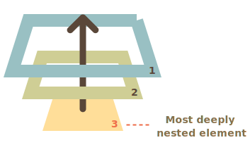

# Gestion des évènements

## Objectif pour le projet

* Savoir ce qu'est un évènement, le récupérer et le gérer
* Définir vos fonctions de callbacks
* Supprimer du contenu en réaction à une action utilisateur (click, frappe de touche, etc...)

## Cours
### Généralité
Un évènement est **le signal** que quelque chose s'est produit, généralement sur votre page HTML. En JavaScript, il s'agit d'une abstraction du pattern observeur/observable. Par exemple :

**Mouse events**
* `click` – quand la souris clique sur un élément (sur les dispositif tactile, cela survient au tap).
* `contextmenu` – quand un clique droit survient.
* `mouseover` / `mouseout` – quand le cursor de la souris survole / sort d'un élement.

**Form element events**
* `submit` – quand un visiteur soumet un `<form>`.
* `focus` – quand un visiteur focus un élément d'un form, e.g. `<input>`.

**Document events**
* `DOMContentLoaded` – quand le HTML est totalement interprété, et donc que le DOM est totalement construit.

**CSS events**
* `transitionend` - quand une animation CSS se termine.

Pour réagir à ces évènements, on utilise des **handler** (gestionnaires). Ce sont des fonctions qui s'exécutent dans le cas où un évènement précis survient. Pour cela, on écoute avec un **listener** ledit évènement.

```javascript
function myhandler(e){ mycodehere; }

var monbutton = document.getElementById("mb");
mb.addEventListener("click", myhandler); 
// peut aussi être une fonction anonyme : ("click", function(e){ mycodehere; });
// ou une arrow function : ("click", (e) => mycode);
```


Vous pouvez aussi utiliser des objets comme handler. L'un des avantages est de permettre une approche de *délégation par objet*. Un petit exemple dans mon [cours ici](https://ceri-num.gitbook.io/uv-frontend/javascript/event#handler-with-an-object).


Quand un évènement survient, un **objet event** généralement est généré, et contient un nombre d'information imporante pour traiter correctement l'action réalisée. La propriété `target` de l'évènement contient le noeud qui subit l'action (le type de noeud est déréférencable via la propriété `tagName` de target).

### Bubbling
Le principe du *bubbling* est le suivant : quand un évènement survient sur un élément de votre page, le handler associé à cet élément est appelé, **puis l'évènement est passé à l'élément parent** qui appelle son handler (s'il en a un) pour cet évènement, et ainsi de suite jusqu'au *root* de la page.



Ce principe est très utile pour attacher des comportements génériques ou rendre des noeuds imbriqués réactif à un même évènement. Par exemple :

```html
<div onclick="alert('mon handler est appelé')">
  <p>Même si vous cliquez <code>ICI</code>.
</div>
```

Quid de la propriété `target` de l'évènement alors ? C'est simple :
* `event.target` correspond toujours au noeud le plus profond qui a reçu l'évènement (*i.e.* le premier élément de la page qui a reçu l'évènement) ;
* `this` ou `event.currentTarget` (en fonction de si vous utilisez des fonctions anonymes ou des arrows) dans un handler permet de savoir quel élément est en train de traiter l'évènement.

En reprenant l'exemple précédent, en cliquant sur l'élément `code` :
* `event.target.tagName` = `code`
* `this.tagName` = `div`

Alors qu'en cliquant sur la `div` :
En reprenant l'exemple précédent, en cliquant sur l'élément `code` :
* `event.target.tagName` = `div`
* `this.tagName` = `div`

Dans certains cas, on a besoin de stopper le bubbling -- par exemple lorsque un élément parent écoute le même évènement que son enfant, mais n'a pas le même handler. Si on ne supprimait pas le bubbling, et en supposant qu'on clique sur le noeud enfant, on exécuterait d'abord l'handler de l'enfant **PUIS** celui du parent ! Pour arrêter le bubbling, on invoque la fonction `stopPropagation()` de l'évènement dans un handler.


## Exercice d'introduction
Pour vous aider à vous approprier l'ajout et la suppression d'handlers, considérer l'exercice suivant. Soit deux boutons HTML classique sur votre page, identifiés respectivement par `b1` et `b2`, on veut alterné le bouton qui possède un listener sur l'évènement `click`. 

Aussi, lorsque la page est servi à votre client, seul `b1` possède un handler pour son évènement de `click` ; `b2` n'en possède pas. Lorsque `b1` est cliqué, il associe à `b2` un listener sur l'évènement `click`, et `b1` lui perd le sien, de tel sorte qu'en cliquant deux fois de suite sur `b1`, rien ne se passe. Le comporte est identique pour `b2` : en cliquant une fois dessus lorsqu'il s'est vu attribué son listener, il le perd et le donne de nouveau à `b1` et donc, cliquer une deuxième fois de suite sur `b2` ne fait plus rien.

## Exercice
Dans cette exercice, nous implémenterons un bouton "like" sur nos médias.

Imaginons le code HTML du bouton
```html
<div>
    <h4>Mon média 1</h4>
    <div class="like-b">
        <span>Liked!</span>
        <i class="like-b fa fa-heart"></i>
    </div>
</div>
```

Stylisons le un peu. Importez directement dans votre page ou *via* un fichier le CSS suivant (car je suis gentil alors que j'écris les lignes pendant mon WE ! grr)
```css
.like-b > i {
  cursor:pointer;
  padding:10px 12px 8px;
  background:#fff;
  border-radius:50%;
  display:inline-block;
  margin:0 0 15px;
  color:#aaa;
  transition:.2s;
}

.like-b > i:hover {
  color:#666;
}

.like-b > span {
  position: absolute;
  bottom:70px;
  left:0;
  right:0;
  visibility: hidden;
  transition:.6s;
  z-index:2;
  font-size:2px;
  color:transparent;
  font-weight:400;
}

.like-b > i.press {
  animation: size .4s;
  color:#e23b3b;
}

.like-b > span.press {
  bottom:120px;
  font-size:14px;
  visibility:visible;
  animation: fade 1s;
}

@keyframes fade {
  0% {color:rgba(0,0,0,1);}
  50% {color:#e23b3b;}
  100% {color:rgba(0,0,0,1);}
}

@keyframes size {
  0% {padding:10px 12px 8px;}
  50% {padding:14px 16px 12px;  
    margin-top:-4px;}
  100% {padding:10px 12px 8px;}
}
```
1. Que fait ce code CSS ?
2. Avez-vous identifié comment le comportement du bouton ?

En effet, nous utiliserons la classe `.press` pour identifier si oui ou non le bouton a été cliqué.

3. Codez la logique associé à ce bouton like. Vous utiliserez la méthode `toggle` qui utilise une `DOMString` pour jouer avec les jetons classes. Vous aurez aussi envie d'utiliser la propriété `.children` d'un noeud pour ne récupérer que les noeuds HTML, sans le texte et autre. 


Le corps de la fonction ne fait que deux lignes.


## Exercice -- Déplacement *via* le clavier
Dans cet exercice, vous réagirez à certaines touches clavier pour parcours votre bibliothèque de média (par exemple avec Ctrl + arrow left/right).

Vous pouvez partir du code HTML suivant
```html
<div>
    <div id="focus"></div>

    <div id="medias">
        <div id="m1">
            <h4 class="title">Title1</h4>
            <p class="descr">Description description...</p>
            
        </div>
        <div id="m2">
            <h4 class="title">Title2</h4>
            <p class="descr">Description description...</p>
            
        </div>
        <div id="m3">
            <h4 class="title">Title3</h4>
            <p class="descr">Description description...</p>
            
        </div>
    </div>
</div>
```
La zone en haut, de focus, donne des détails sur le média sélectionné (`on-focus`). Par défaut, les descriptions et les images doivent être masqués dans la liste. A chaque appuie de flèche, mettre à jour votre zone de focus.


Vous aurez encore besoin de jouer avec la propriété CSS `visibility:hidden`.


## Exercice
Imaginons maintenant qu'en tant qu'administrateur votre serveur peut vous renvoyer un tableau d'utilisateurs. Vous voulez pouvoir l'ordonner de manière ascendante. Soit le code HTML suivant :
```html
<html>

<head>
  <meta charset="utf-8">
  <style>
    table {
       border-collapse: collapse;
     }
     th, td {
       border: 1px solid black;
       padding: 4px;
     }
     th {
       cursor: pointer;
     }
     th:hover {
       background: yellow;
     }
  </style>
</head>

<body>
  <table id="grid">
    <thead>
      <tr>
        <th data-type="number">ID</th>
        <th data-type="string">Name</th>
      </tr>
    </thead>
    <tbody>
      <tr>
        <td>7</td>
        <td>John</td>
      </tr>
      <tr>
        <td>2</td>
        <td>Pete</td>
      </tr>
      <tr>
        <td>36</td>
        <td>Ann</td>
      </tr>
      <tr>
        <td>87</td>
        <td>Eugene</td>
      </tr>
      <tr>
        <td>1</td>
        <td>Ilya</td>
      </tr>
    </tbody>
  </table>
</body>
</html>
```

Et le code JavaScript suivant :

```javascript
"use strict";

grid.onclick = function(e) {
    if (e.target.tagName != 'TH') return;

    // ECRIRE ICI
};

function sortGrid(colNum, type) {
    let tbody = grid.querySelector('tbody');

    let rowsArray = Array.from(tbody.rows);

    // compare(a, b) compares two rows, need for sorting
    let compare;

    switch (type) {
    case 'number':
        compare = function(rowA, rowB) {
        return rowA.cells[colNum].innerHTML - rowB.cells[colNum].innerHTML;
        };
        break;
    case 'string':
        compare = function(rowA, rowB) {
        return rowA.cells[colNum].innerHTML > rowB.cells[colNum].innerHTML ? 1 : -1;
        };
        break;
    }

    // sort
    rowsArray.sort(compare);

    tbody.append(...rowsArray);
}
```

1. Imprégnez vous du code JS ;
2. Faîtes fonctionner le code.

## Exercice -- délégation d'évènements
Cet exercice va vous servir à bien comprendre le concept de capture et de "Bubbling" des évènements.

1. Recopiez et jouer avec le code suivant : ```html
<html>
<head>
    <style>
    body * {
        margin: 10px;
        border: 1px solid blue;
    }
    </style>
</head>

<body>
    <form onclick="alert('form')">FORM
        <div onclick="alert('div')">DIV
            <p onclick="alert('p')">P</p>
        </div>
    </form>
</body>
```
2. Que constatez vous ?

Très bien. Imaginez maintenant que vous êtes en train de consulter le catalogue de média, sous forme de grille, pour les ajouter à une playlist :
```html
<table>
    <tr>
        <th colspan="3"><em>MediaType</em> : Click on the media you want to add/remove</th>
    </tr>
    <tr>
        <td class="media"><strong>M1</strong><br>Title<br>Descr<br>Img</td>
        <td class="media"><strong>M2</strong><br>Title<br>Descr<br>Img</td>
        <td class="media"><strong>M3</strong><br>Title<br>Descr<br>Img</td>
    </tr>
    <tr>
        <td class="media"><strong>M4</strong><br>Title<br>Descr<br>Img</td>
        <td class="media"><strong>M5</strong><br>Title<br>Descr<br>Img</td>
        <td class="media"><strong>M6</strong><br>Title<br>Descr<br>Img</td>
    </tr>
    <tr>
        <td class="media"><strong>M7</strong><br>Title<br>Descr<br>Img</td>
        <td class="media"><strong>M8</strong><br>Title<br>Descr<br>Img</td>
        <td class="media"><strong>M9</strong><br>Title<br>Descr<br>Img</td>
    </tr>
</table>
```

3. Vous allez **déléguer la gestion du clique** à votre `table` en jouant avec la propriété `target` de l'évènement `click` ; cela évitera d'avoir une quantité faramineuse de listener sur votre page et améliorera drastiquement la qualité et la maintenabilité de votre code. Du coup, aucun `td` ne doit directement avoir de handler ni de listener `click`. Faîtes apparaître une alerte pour indiquer que l'élément `Mx` à bien été ajouté à la playlist.


Attention, dans votre `table`, il n'y a pas que des `td` ! Vous devez donc vérifier si le target est bien un `td`. Vous pouvez utiliser la propriété `tagName` de votre target pour cela (comme pour l'exercice précédent avec `th` donc).


4. Vous avez dû remarquer la présence de balise `strong` dans vos `td`. Que se passe-t-il si vous cliquez dessus ? Normalement, votre délégation d'évènement ne doit pas fonctionner, puisque vous vérifier uniquement que le clique se produit bien dans une cellule. En utilisant `event.target.closest('td')` vous récupérer l'ancêtre le plus proche de l'ancêtre passé en paramètre. Assurez vous juste que l'élément que vous récupérez appartient bien au tableau, et le tour est joué !

## Exercice -- image de profil
Dans cette partie, nous travaillerons à uploader une image de profil pour un utilisateur donner. Considérons le code HTML suivant :

```html
<div id="preview"></div>
    
<input id="upload" type="file" value="Upload your image">
```

1. Attacher un handler à l'input qui appellera la fonction `handleFiles` et qui lui enverra la liste des fichiers.

Soit la fonction `handleFiles` suivante, à compléter, qui permet de créer une balise image et d'afficher le contenu de l'image dans la div `preview` :
```javascript
function handleFiles(files) {
    for (let i = 0; i < files.length; i++) {
      const file = files[i];
  
      if (!file.type.startsWith('image/')){ continue }
  
      //A COMPLETER ICI
  
      const reader = new FileReader();
      reader.onload = (function(aImg) { return function(e) { aImg.src = e.target.result; }; })(img);
      reader.readAsDataURL(file);
    }
  }
```
2. Compléter la fonction en créant une balise `img` à laquelle vous ajouterez à sa propriété `file` l'image courante avant de mettre la balise dans le preview.
3. On veut maintenant cacher le bouton `input` qui est moche, et ne réagir que sur le clique de l'avatar pour modifier ce dernier. Faîtes les modifications nécessaires.

Nous allons maintenant gérer le drag and drop d'une image qui s'affichera toujours dans le `preview`. Modifier votre code HTML en rajoutant une zone de D&D
```html
<div id="preview"></div>
    
<input id="upload" type="file" value="Upload your image">
<div id="dropbox">
    This is the dropzone

    Here and there
</div>
```
4. Identifier les 3 évènements qui sont liés au drag & drop dont vous aurez besoins ;
5. Ajouter simplement les listeners associés à la zone de `dropbox`, avec une alerte -- testez le comportement.
6. Vous remarquerez peut-être que ces 3 évènements bubbles : empêcher cela avec la bonne méthode.
7. Maintenant, on va supprimer le comportement par défaut qui pourrait exister pour ces évènements pour implémenter le notre. Si vous ne vous souvenez plus de la méthode, il s'agit de `preventDefault` que l'on a vue dans la [section sur les formulaires](js-form.md).
8. On veut accéder aux données lâchées au moment du "drop". Pour ce faire, l'évènement possède une propriété `dataTransfert`. 
9. Avant d'envoyer la liste des fichiers à notre fonction `handleFiles` il faut les récupérer dans `dataTransfert`.

Et voila, une image de profil qui gère du D&D, classe !